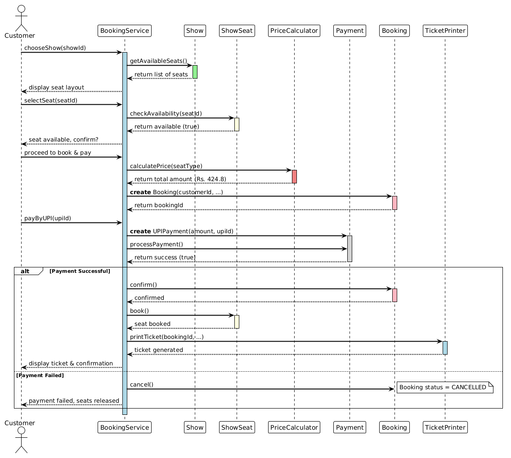
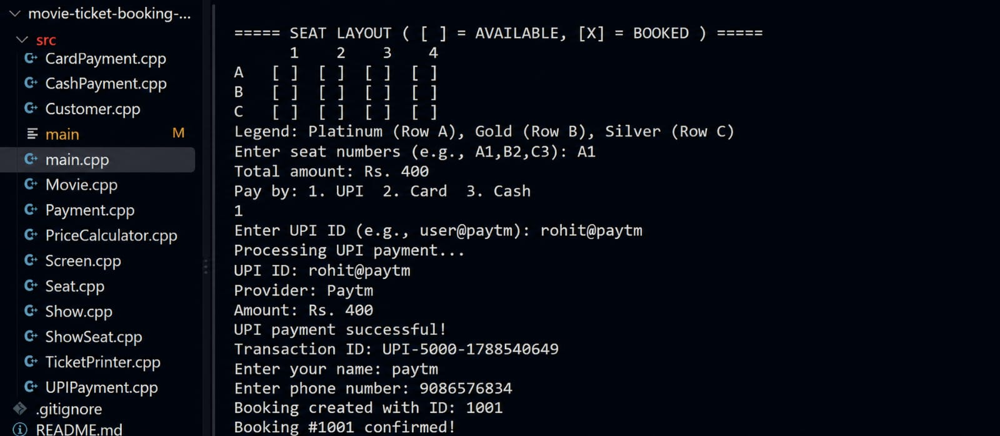
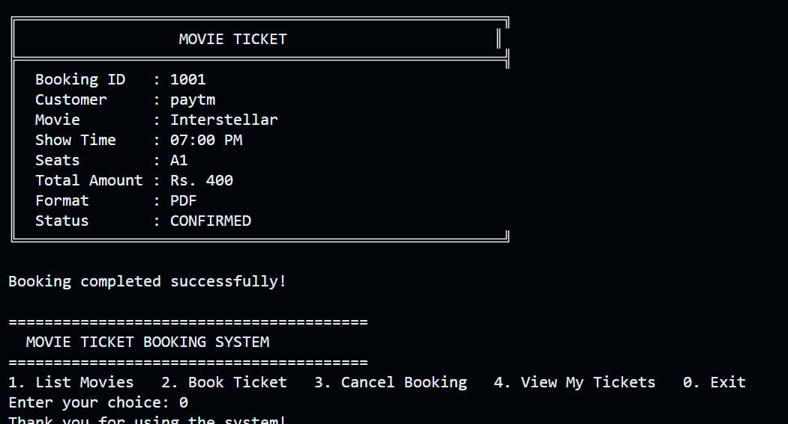

# Movie Ticket Booking System

## TCS-504 System Design – Assignment 1

### Features
- List movies, shows, seat layout
- Book seats with UPI/Card/Cash
- Print ticket and cancel booking
---

## UML Diagrams

### Class Diagram


### Sequence Diagram 

---
##  Demo Run 

### 1. Main Menu & Listing Movies


### 2. Booking Flow – Selecting Show and Seats


### 3. Payment, Ticket, and Confirmation


---

### How to Run
```bash
g++ src/main.cpp -o ticket-system
./ticket-system
```
---
## Author

ROHIT SINGH
